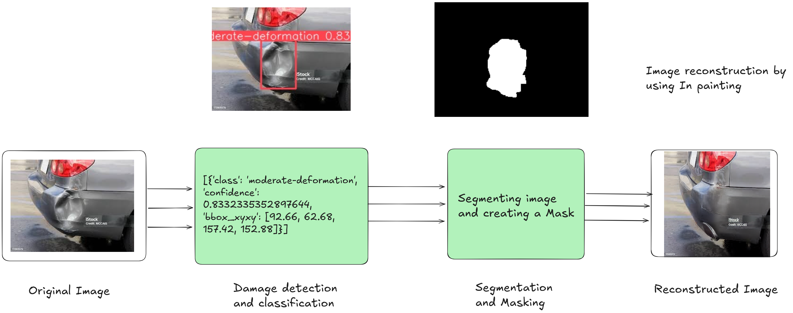

# Vehicle Damage Detection & Repair

An AI-powered computer vision pipeline for automated vehicle damage assessment and visualization. This project addresses the subjectivity and inefficiency of manual vehicle damage inspections by providing an end-to-end system that detects damage, segments it, and visualizes the repaired vehicle.

> **Note:** It is highly recommended to open the `Vehicle_damage_detection_and_repair.ipynb` notebook in **Google Colab**. The notebook contains interactive components (such as  upload widgets) that are optimized for the Colab environment.

## Project Goal
To develop an automated system capable of detecting vehicle damage, estimating its extent, and generating realistic visualizations of the repaired vehicle.

## Technical Architecture (Phasewise Implementation)

### Phase 1: Damage Detection (YOLOv8)
* **Objective:** Automatically detect and localize damage (dents, scratches, cracks) on vehicle images.
* **Model:** YOLOv8s (Fine-tuned).
* **Dataset:** 2,000 images from Roboflow (Damage Severity dataset).
* **Training Strategy:**
    * **Transfer Learning:** Initialized with pretrained `yolov8s.pt` weights.
    * **Freeze-Backbone:** First 10 layers were frozen during initial training to retain fundamental feature extraction capabilities.
    * **Unfreezing:** Subsequent training involved unfreezing layers to adapt the model specifically to damage classes.
* **Performance:**
    * **mAP50:** 40.45%
    * **Precision:** 41.00%
    * **Recall:** 26.44%

### Phase 2: Segmentation (SAM - Segment Anything Model)
* **Objective:** Convert bounding box detections into precise, pixel-level segmentation masks.
* **Model:** Segment Anything Model (SAM) - `vit_h`.
* **Implementation:** Zero-shot capability. YOLO detection boxes are used as prompts for SAM to generate binary masks.
* **Result:** Pixel-perfect isolation of damaged areas without class-specific training.

### Phase 3: Repair Visualization (ControlNet + Stable Diffusion)
* **Objective:** Generate a realistic image of the vehicle as it would look after repairs.
* **Model:** Stable Diffusion Inpainting pipeline controlled by ControlNet.
* **Process:** The system takes the original image and the SAM-generated mask to "inpaint" clean vehicle parts over the damaged areas.
* **Speed:** Generates repair visualizations in approximately 3-5 seconds.

## Business Impact
This system offers a significant efficiency upgrade over traditional manual surveying methods (based on an Indian market case study):

* **Processing Time:** Reduced from ~8.5 minutes (manual) to ~10 seconds (AI).
* **Cost Reduction:** Estimated ~83% reduction in processing costs (from ₹395 to ₹67 per image).
* **Scalability:** A team of 4 Quality Analysts using this AI can match the output of ~50 manual surveyors.
* **ROI:** Estimated payback period of ~2 months with a 506% ROI in Year 1.

## Visualizing the Pipeline
For a granular look at how the model processes an image, please refer to the `image_processing_step` folder. This directory contains:
* Step-by-step intermediate images.
* Visualizations of the raw YOLO bounding boxes.
* The binary segmentation masks generated by SAM.
* The in-painting layers before the final merge.

## Usage
1.  **Open in Colab:** Click the "Open in Colab" badge above or upload the notebook to Google Colab.
2.  **Run the Pipeline:**
    * **Input:** Upload an image of a damaged vehicle using the interactive widget.
    * **Process:**
        1.  Image passed to YOLOv8 for bounding box detection.
        2.  Bounding boxes passed to SAM for mask generation.
        3.  Original image + Mask passed to ControlNet for inpainting.
    * **Output:** View the final repaired visualization directly in the notebook output cells.

## Technologies Used
* Python
* Ultralytics YOLOv8
* Meta AI Segment Anything Model (SAM)
* Hugging Face Diffusers (Stable Diffusion & ControlNet)
* OpenCV, PIL

## 👥 Team

**Course:** AAI-521 Computer Vision  
**Institution:** University of San Diego  
**Semester:** Fall 2024

| Member | Role |
|--------|------|
| Pavan Kumar Kallakuri | Data Collection & EDA |
| Sajesh Kariadan | Model Development |
| Nishchal P | Evaluation & Testing |

## 🙏 Acknowledgments

- University of San Diego - AAI Program
- Roboflow - Dataset hosting
- TensorFlow Team - Framework
- Google Colab - Free GPU access

## 📧 Contact

**GitHub:** 

- [pavankallakuri9](https://github.com/pavankallakuri9)
- [Nishchal](https://github.com/Nishchal-dl) 

**Project Link:** [Vehicle Damage Detection](https://github.com/pavankallakuri9/vehicledamagedetection)

---

⭐ **Star this repo if you found it helpful!**
